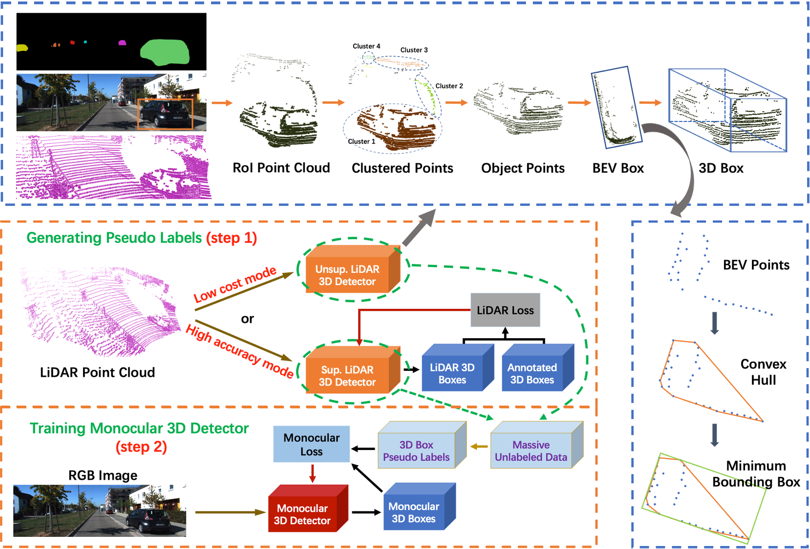

# LPCG

<p align="center">  </p>

## Introduction

This is the PyTorch implementation of the paper Lidar Point Cloud Guided Monocular 3D Object Detection, In ECCV'22, Liang Peng, Fei Liu, Zhengxu Yu, Senbo Yan, Dan Deng, Zheng Yang, Haifeng Liu, and Deng Cai. 
[[paper]](https://arxiv.org/abs/2104.09035)

## Abstract

Monocular 3D object detection is a challenging task in the self-driving and computer vision community. As a common practice, most previous works use manually annotated 3D box labels, where the annotating process is expensive. In this paper, we find that the precisely and carefully annotated labels may be unnecessary in monocular 3D detection, which is an interesting and counterintuitive finding. Using rough labels that are randomly disturbed, the detector can achieve very close accuracy compared to the one using the ground-truth labels. We delve into this underlying mechanism and then empirically find that: concerning the label accuracy, the 3D location part in the label is preferred compared to other parts of labels. Motivated by the conclusions above and considering the precise LiDAR 3D measurement, we propose a simple and effective framework, dubbed LiDAR point cloud guided monocular 3D object detection (LPCG). This framework is capable of either reducing the annotation costs or considerably boosting the detection accuracy without introducing extra annotation costs. Specifically, It generates pseudo labels from unlabeled LiDAR point clouds. Thanks to accurate LiDAR 3D measurements in 3D space, such pseudo labels can replace manually annotated labels in the training of monocular 3D detectors, since their 3D location information is precise. LPCG can be applied into any monocular 3D detector to fully use massive unlabeled data in a self-driving system. As a result, in KITTI benchmark, we take the first place on both monocular 3D and BEV (bird's-eye-view) detection with a significant margin. In Waymo benchmark, our method using 10% labeled data achieves comparable accuracy to the baseline detector using 100% labeled data. 

## Overview

- [Installation](#installation)
- [Getting Started](#getting-started)
- [Pretrained Model](#pretrained-model)
- [Citation](#citation)

## Installation

### Installation Steps

a. Clone this repository.

```shell
git clone https://github.com/SPengLiang/LPCG
```

b. Install the dependent libraries as follows:

* Install the dependent python libraries: 
  
  ```shell
  pip install torch==1.10.0 torchvision==0.11.1 sklearn opencv tqdm
  ```

* We test this repository on Nvidia 3080Ti GPUs and Ubuntu 18.04.

## Getting Started

### Dataset Preparation

Currently we provide the dataloader of KITTI dataset.
You can download the entire [raw KITTI dataset](http://www.cvlibs.net/datasets/kitti/raw_data.php) by running:

```shell
wget -i ./data/kitti/data_file/kitti_archives_to_download.txt -P kitti_data/
```

Then unzip with

```shell
cd kitti_data
unzip "*.zip"
cd ..
ln -s kitti_data ./data/kitti/raw_data
```

**Warning:** it weighs about **175GB**, so make sure you have enough space to unzip.

* Please download the official [KITTI 3D object detection](http://www.cvlibs.net/datasets/kitti/eval_object.php?obj_benchmark=3d) dataset and organize the downloaded files as follows:

```
LPCG_PATH
├── data
│   ├── kitti
│   │   │── data_file
│   │   │── raw_data
│   │   │── KITTI3D
|   │   │   │── training
|   │   │   │   ├──calib & velodyne & label_2 & image_2
|   │   │   │── testing
|   │   │   │   ├──calib & velodyne & image_2
├── config
├── high_acc
├── low_cost
├── ...
```

The raw_data refers to the soft link to the raw KITTI dataset.

* You can also choose to link your KITTI dataset path by
  
  ```
  KITTI_DATA_PATH=~/data/kitti_object
  ln -s $KITTI_DATA_PATH/training/ ./data/kitti/KITTI3D/
  ln -s $KITTI_DATA_PATH/testing/ ./data/kitti/KITTI3D/
  ```

* Prepare KITTI raw dataset for training.       
  
  If you use our pre-generated data files, you can skip [prepare_kitti_raw_datafile.py](data/kitti/prepare_kitti_raw_datafile.py).
  
  ```python
  python data/kitti/prepare_kitti_raw_datafile.py (#optionally)
  python data/kitti/link_kitti_raw.py
  ```

### Training & Testing

#### Train a model

##### Step 1: obtain pseudo labels

###### For high accuracy mode

Use the pretrained model in OpenPCDet (we use the pre-trained [PV-RCNN](https://drive.google.com/file/d/1sCCDaCuHBJxIeguImCZyEEbi9VDakZa1/view?usp=sharing), you can also use other lidar models as you wanted). Please clone [OpenPCDet](https://github.com/open-mmlab/OpenPCDet) under the high_acc folder and follow their installation guidelines.
Then, generate pseudo labels on KITTI raw data (exclude validation sequences).

```shell
cp high_acc/infer_kitti.py  high_acc/OpenPCDet/tools/
cd high_acc/OpenPCDet/tools
CUDA_VISIBLE_DEVICES=0 python infer_kitti.py --cfg_file cfgs/kitti_models/pv_rcnn.yaml --ckpt ../pv_rcnn_8369.pth --data_path /pvc_user/pengliang/LPCG/data/kitti/kitti_merge/training/velodyne
cd ../../..
```

To ease the usage, we provide pre-generated pseudo labels and converted calibration files (we only converted P2 and Tr_velo_to_cam) [Pseudo-Labels](https://drive.google.com/file/d/1NBfPCb9eE1m5RHgA1ljKD_PdsuiceSN7/view?usp=sharing), [Filtered-Pseudo-Labels](https://drive.google.com/file/d/1plat_KKn0hlYIq6xJl4gJ5FYiQWGc51F/view?usp=sharing) (removed some outliers and only keep cars), [Calibration](https://drive.google.com/file/d/1XAs8I7LJeCcWNGFzAaWAY384fZYfKdL-/view?usp=sharing).
Please note, the ids of pre-generated pseudo labels corresponds to the pre-generated [kitti_raw_name](data/kitti/data_file/split/train_raw.txt) (If you generate this file by yourself ([prepare_kitti_raw_datafile.py](./data/kitti/prepare_kitti_raw_datafile.py) ) , your generated file is different from the provided one because of the np.random.shuffle operation ).

###### For low cost mode

- Generate object 2D maks by mask-rcnn: 
  
  ```python
  python low_cost/seg_img.py
  ```

- Then, generate pseudo labels on KITTI raw data (exclude validation sequences).
  
  ```python
  python low_cost/det.py
  ```

###### Filter pseudo labels and link kitti validation labels

- Filter out empty pseudo labels for training and then link the validation labels. 
  
  If you use our pre-generated [Filtered-Pseudo-Labels](https://drive.google.com/file/d/1plat_KKn0hlYIq6xJl4gJ5FYiQWGc51F/view?usp=sharing) on the high accuracy mode, you can skip [filter_labels.py](tools/filter_labels.py)
  
  ```python
  python tools/filter_labels.py 
  python tools/link_kitti_val_labels.py
  ```

##### Step 2: train monocular models using pseudo labels

Once you generate these pseudo labels, you can use them to train your model.
We use [M3D-RPN](https://github.com/garrickbrazil/M3D-RPN) and [MonoFlex](https://github.com/Owen-Liuyuxuan/visualDet3D) as the baseline monocular 3D detector.

#### Testing monocular models

Please refer to the corresponding monocular 3D detection codebases you used and then follow their evaluation guidelines (we use [M3D-RPN](https://github.com/garrickbrazil/M3D-RPN) and [VisualDet3D](https://github.com/Owen-Liuyuxuan/visualDet3D) codebases). 

## Pretrained Models

To ease the usage, we provide the pre-trained model using high accurate mode: M3D-RPN [Google Drive](https://drive.google.com/file/d/1wkMsFXLQLIWwh6pfN6rvG1tklUONbWEM/view?usp=sharing), [Codes](https://github.com/garrickbrazil/M3D-RPN), MonoFlex (in VisualDet3D) [Google Drive](https://drive.google.com/file/d/1s_C0OH5OcnJE4XU7Ms24UaEy3O4Sz7UX/view?usp=sharing), [Codes](https://github.com/Owen-Liuyuxuan/visualDet3D).
You can directly load the pre-trained model and then perform inference.

## Others

This repository will be cleaned and improved further when I have free time.

## Citation

```
@inproceedings{peng2022lidar,
  title={Lidar Point Cloud Guided Monocular 3D Object Detection},
  author={Peng, Liang and Liu, Fei and Yu, Zhengxu and Yan, Senbo and Deng, Dan and Yang, Zheng and Liu, Haifeng and Cai, Deng},
  booktitle={European Conference on Computer Vision},
  year={2022}
}
```

## Acknowledgements

The code benefits from [M3D-RPN](https://github.com/garrickbrazil/M3D-RPN), [VisualDet3D](https://github.com/Owen-Liuyuxuan/visualDet3D), [OpenPCDet](https://github.com/open-mmlab/OpenPCDet), [Monodepth2](https://github.com/nianticlabs/monodepth2), and [Second](https://github.com/traveller59/second.pytorch). Thanks for their great works!